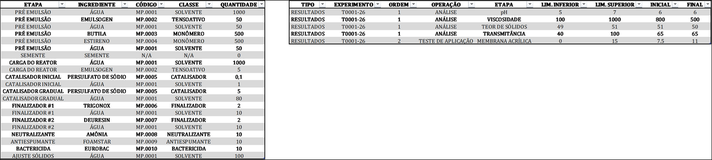
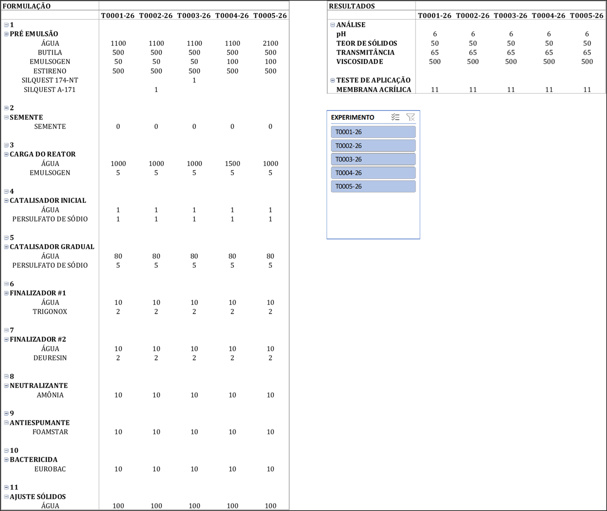

# Experiment Analyzer — Formulation Tracking Tool

## The Problem
In R&D environments, formulation knowledge is often concentrated in a single decision-maker. For those running the experiments, it was hard to connect those changes to the results — making it difficult to build real understanding of what was actually being done and why.

## The Solution
A structured Excel-based tool enabling side-by-side comparison of formulations, analyses, and application test results across all experiments within a project. The goal was to give the team more analytical power, a clearer sense of cause and effect, and most importantly — historical control, making R&D less dependent on a single person.

## Tool Structure

Each project corresponds to an individual Excel file. Experiments are organized in separate tabs following a standardized schema. Power Query consolidates all experiments into a central table, updating automatically upon addition of new tabs. A Pivot Table layer enables dynamic, filterable comparison across any combination of experiments.

## How to Use
1. Create a new tab for each experiment, following the standardized Formulation and Results table structure.
2. Duplicate an existing tab to ensure formatting consistency
3. Refresh the Power Query connection to automatically integrate the new experiment into the central table
4. Use Pivot Table filters in the central tab to perform cross-experiment analysis

## Screenshots

**Experiment tab** — where formulation and results data is manually entered for each experiment

**Analysis view** — side-by-side comparison of all experiments using Pivot Table filters

## Limitations & Next Steps
The tool solves traceability, but interpreting the changes is still manual. The natural next step would be integrating a language model that receives the experiment history and results and suggests directions for the next cycle — reducing dependence on intuition and speeding up decisions. Connecting the data to Power BI for automatic report generation is also on the roadmap.

## Tech Stack
Microsoft Excel · Power Query · Pivot Table
